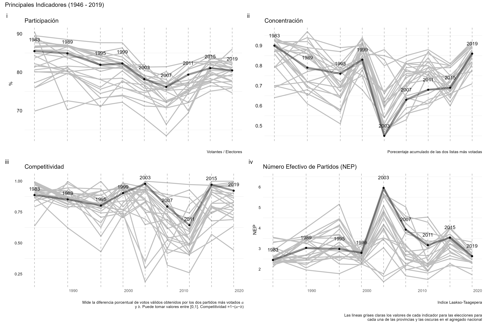

<!-- README.md is generated from README.Rmd. Please edit that file -->

```{r, include = FALSE}
knitr::opts_chunk$set(
  collapse = TRUE,
  comment = "#>"
)
```

# Los partidos políticos argentinos y sus sistemas desde 1983 a la actualidad


Este proyecto se corresponde con la sección **Una democracia en datos** del artículo en colaboración entre Juan Manuel Abal Medina  y Juan Pablo Ruiz Nicolini. 


```{r echo = FALSE}
 
```


## CONTENIDO


* En este repositorio se incluye el código fuente para el acceso a datos y generación de insumos incluidos en el análisis. 

* La mayor parte del procesamiento se realizo a través del proyecto  [`electorAr`](https://politicaargentina.github.io/electorAr/): una librería de `R` que brinda herramientas que facilitan el acceso y el trabajo con datos electorales de Argentina. 

* La fuente original (detrás de `electorAr`) es  el [Atla Electoral de Andy Tow](https://www.andytow.com/atlas/totalpais/)


## Indicadores relevados

* El análisis se concentra principalmente en datos relativos a las elecciones presidenciales desde el retorno de la democracia (1983 -2019)

* Se comparten datos e indicadores tales como: 

- Número Efectivo de Partidos (NEP)
- Particiación electoral
- Competitividad
- Concentración


## La estructura de los archivos se organiza del siguiente modo: 

1. En [codigo]("https://github.com/TuQmano/arg_demorcracia40/tree/main/codigo") se encuentran los _scripts_ para:

 - Descarga de datos
 - Generación de indicadores
 - Tabulados y Gráficos
 
2. En [plots]("https://github.com/TuQmano/arg_demorcracia40/tree/main/plots") se guardan las salidas (gráficos y tablas) que ilustran los indicadores